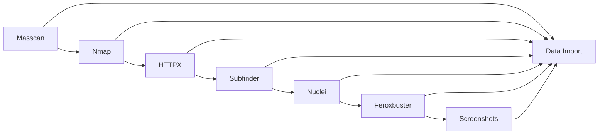

# Waluigi - reverge collector framework

<div align="center">


**A comprehensive, distributed security scanning and reconnaissance framework**

[Features](#features) • [Installation](#installation) • [Usage](#usage) • [Architecture](#architecture) • [Tools](#supported-tools) • [API](#api-reference)

</div>

---

## 🎯 Overview

**Waluigi** is a powerful, distributed security reconnaissance framework designed for red teamers, offensive security engineers, penetration testers, bug bounty hunters, and security researchers. It acts as the collector component for the [reverge](https://www.reverge.io/) attack surface management tool. Built with Python and Luigi task orchestration, it provides automated, scalable scanning capabilities across multiple security tools and methodologies.

### Key Highlights

- 🚀 **Distributed Architecture** - Scalable collector-manager design
- 🔧 **Multi-Tool Integration** - Seamless integration with 10+ security tools
- 📊 **Intelligent Optimization** - Smart scan ordering and result correlation
- 🌐 **Web-Scale Scanning** - Handle massive target lists efficiently
- 🔒 **Secure Communication** - Encrypted data transmission and API authentication
- 📈 **Real-time Monitoring** - Live scan status and progress tracking

---

## ✨ Features

### 🎛️ **Comprehensive Scanning Capabilities**
- **Network Discovery**: Port scanning with Masscan and Nmap
- **Web Application Testing**: HTTP probing with HTTPX
- **Subdomain Enumeration**: Advanced DNS discovery with Subfinder
- **Vulnerability Assessment**: Template-based scanning with Nuclei
- **Directory Discovery**: Web path enumeration with Feroxbuster
- **Visual Analysis**: Screenshot capture and analysis
- **Certificate Analysis**: SSL/TLS certificate inspection and domain extraction

### 🏗️ **Advanced Architecture**
- **Luigi Task Orchestration**: Robust workflow management and dependency handling
- **Distributed Processing**: Multi-collector deployment with centralized management
- **Intelligent Scan Optimization**: Tool ordering based on previous results
- **Parallel Execution**: Concurrent scanning for maximum performance
- **Process Management**: Advanced process tracking and cancellation capabilities

### 🔐 **Security & Reliability**
- **Encrypted Communication**: AES-256 encryption for all data transmission
- **API Authentication**: Bearer token-based secure API access
- **Session Management**: Robust session handling with key rotation
- **Error Handling**: Comprehensive exception management and recovery
- **Resource Management**: Memory and CPU optimization for large-scale scans

### 📊 **Data Management**
- **Structured Data Models**: Comprehensive object-oriented data representation
- **Relationship Mapping**: Intelligent correlation between scan results
- **Deduplication**: Advanced duplicate detection and removal
- **Export Capabilities**: Multiple output formats and integration options
- **Historical Tracking**: Scan history and progress monitoring

---

## 🚀 Installation

### Prerequisites

- **Operating System**: Linux (Ubuntu 20.04+ recommended)
- **Python**: 3.9 or higher
- **Memory**: 2GB RAM minimum (4GB+ recommended)
- **Storage**: 10GB available space
- **Network**: Internet connectivity for tool downloads

### Quick Install

```bash
# Clone the repository
git clone https://github.com/securifera/reverge_collector.git
cd reverge_collector

# Run the automated installer
chmod +x install.sh
sudo ./install.sh

# Install Python dependencies
pip install -r requirements.txt

# Or use Poetry for dependency management
poetry install
```

### Manual Installation

<details>
<summary>Click to expand manual installation steps</summary>

```bash
# 1. Install system dependencies
sudo apt update
sudo apt install -y python3 python3-pip git curl wget

# 2. Install security tools
# Masscan
sudo apt install -y masscan

# Nmap
sudo apt install -y nmap

# Install Go (for ProjectDiscovery tools)
wget https://golang.org/dl/go1.21.0.linux-amd64.tar.gz
sudo tar -C /usr/local -xzf go1.21.0.linux-amd64.tar.gz
export PATH=$PATH:/usr/local/go/bin

# Install ProjectDiscovery tools
go install -v github.com/projectdiscovery/httpx/cmd/httpx@latest
go install -v github.com/projectdiscovery/subfinder/v2/cmd/subfinder@latest
go install -v github.com/projectdiscovery/nuclei/v3/cmd/nuclei@latest

# Feroxbuster
wget https://github.com/epi052/feroxbuster/releases/latest/download/feroxbuster_amd64.deb
sudo dpkg -i feroxbuster_amd64.deb

# 3. Install Python dependencies
pip install -r requirements.txt

```

</details>

### Docker Installation

[Collector Docker](https://github.com/securifera/collector-docker)

---

## 📖 Usage

### Quick Start

```bash
# Start the scan collector
source venv/bin/activate
python3 waluigi/scan_poller.py -x COLLECTOR_API_KEY
```

### Interactive Console

Once running, the interactive console provides real-time control:

```
> h                    # Show help
> d                    # Toggle debug mode
> x                    # Toggle scanner thread
> q                    # Quit application
```

## 🏛️ Architecture

### System Overview

```
┌─────────────────┐    ┌─────────────────┐
│   Reverge       │    │   Collectors    │
│                 │◄──►│                 │
│  - Dashboard    │    │  - Tool Exec    │
│  - Scan Config  │    │  - Data Proc    │
│  - Results View │    │  - Status Report│
└─────────────────┘    └─────────────────┘
         │                                             
         │
         │
┌─────────────────┐
│    Database     │
│                 │
│  - Scan Data    │
│  - Tool Results │
│  - User Config  │
└─────────────────┘
```

### Component Details

#### 🎯 **Scan Collector** (`scan_poller.py`)
- Polls manager for scheduled scans
- Orchestrates tool execution
- Reports scan progress and results
- Handles process management and cleanup

#### 🧠 **Reconnaissance Manager** (`recon_manager.py`)
- Central coordination hub
- API communication with manager
- Session and authentication management
- Network interface detection

#### 🔧 **Tool Integration**
Each tool is implemented as a Luigi task with:
- **Configuration Class**: Tool parameters and metadata
- **Scan Task**: Execution logic and process management
- **Import Task**: Result parsing and data model creation

#### 📊 **Data Models** (`data_model.py`)
Comprehensive object-oriented representation:
- `Host`, `Port`, `Domain` - Network assets
- `Certificate`, `WebComponent` - Security artifacts
- `ScanData`, `ToolExecutor` - Scan management
- `CollectionModule` - Modular scan components

---

## 🛠️ Supported Tools

| Tool | Purpose | Integration | Status |
|------|---------|-------------|--------|
| **Masscan** | Fast port scanning | Native binary | ✅ Active |
| **Nmap** | Comprehensive port scanning | python-libnmap | ✅ Active |
| **HTTPX** | HTTP/HTTPS probing | Native binary | ✅ Active |
| **Subfinder** | Subdomain enumeration | Native binary | ✅ Passive |
| **Nuclei** | Vulnerability scanning | Native binary | ✅ Active |
| **Feroxbuster** | Directory enumeration | Native binary | ✅ Active |
| **Shodan** | Search engine integration | Python API | ✅ Passive |
| **Pyshot** | Website Screenshot | PhantomJS | ✅ Active |
| **Crap(Bad)Secrets** | Secret detection | Custom implementation | ✅ Active |
| **WebCapture** | Website Screenshot | Chrome | ✅ Active |
| **IP THC DNS** | Subdomain enumeration & reverse IP lookup | Python API | ✅ Passive |
| **IIS Shortname Scanner** | Website enumeration using IIS Shortname | Python | ✅ Active |

### Tool Execution Flow



---

## 📚 API Reference

### Core Classes

#### `ReconManager`
Central management class for scan coordination.

```python
class ReconManager:
    def __init__(self, token: str, manager_url: str)
    def get_scheduled_scans() -> List[ScheduledScan]
    def get_scan_status(scan_id: str) -> ScanStatus
    def import_data(scan_id: str, tool_id: str, results: Dict)
```

#### `ScheduledScan`
Represents a configured scan with tools and targets.

```python
class ScheduledScan:
    def __init__(self, scan_thread: ScheduledScanThread, scan_data: Dict)
    def update_scan_status(status: ScanStatus, error_msg: str = None)
    def register_tool_executor(tool_id: str, executor: ToolExecutor)
    def kill_scan_processes(tool_ids: List[str] = [])
```

#### `WaluigiTool`
Base class for all integrated security tools.

```python
class WaluigiTool:
    name: str
    description: str
    scan_order: int
    args: str
    scan_func: Callable
    import_func: Callable
```

### Luigi Tasks

Each tool implements standardized Luigi tasks:

```python
class ToolScan(luigi.Task):
    scan_input = luigi.Parameter()
    
    def output(self) -> luigi.LocalTarget
    def run(self) -> None

class ImportToolOutput(luigi.Task):
    def requires(self) -> ToolScan
    def run(self) -> None
```

---

## 🔧 Configuration


### Tool Configuration

Tools can be configured with custom arguments:

```python
# Nmap configuration
nmap_tool = Nmap()
nmap_tool.args = "-sV --script +ssl-cert -T4"

# HTTPX configuration  
httpx_tool = Httpx()
httpx_tool.args = "-favicon -td -t 100 -timeout 5"
```

---

## 🧪 Testing

### Running Tests

```bash
# Run all tests
pytest tests/

# Run specific test modules
pytest tests/routes/test_nmap_scan.py
pytest tests/routes/test_httpx_scan.py

```

### Test Structure

```
tests/
├── conftest.py              # Test configuration
├── routes/                  # Tool-specific tests
│   ├── test_nmap_scan.py
│   ├── test_httpx_scan.py
│   └── test_nuclei_scan.py
```

---

## 🤝 Contributing

We welcome contributions! Please see our [Contributing Guidelines](CONTRIBUTING.md) for details.

### Development Setup

```bash
# Fork and clone the repository
git clone https://github.com/your-username/reverge_collector.git
cd reverge_collector

# Create virtual environment
python -m venv venv
source venv/bin/activate

# Install development dependencies
pip install -r requirements.txt

```

### Code Standards

- **Python Style**: Follow PEP 8 guidelines
- **Type Hints**: Use comprehensive type annotations
- **Documentation**: Sphinx-compatible docstrings required
- **Testing**: Maintain >80% test coverage
- **Security**: Follow security best practices

---

## 📋 Changelog

### v1.0.0 (Current)
- ✅ Initial release with 10 integrated tools
- ✅ Distributed collector-manager architecture
- ✅ Luigi task orchestration
- ✅ Comprehensive API framework
- ✅ Advanced process management

### Roadmap
- 🔄 Additional tool integrations
- 🔄 Machine learning result correlation
- 🔄 Advanced reporting capabilities

---

## 📞 Support

### Documentation
- **Reverge Wiki**: [Reverge Wiki](https://www.reverge.io/)
- **API Docs**: Auto-generated from docstrings

### Community
- **Issues**: [GitHub Issues](https://github.com/securifera/reverge_collector/issues)
- **Discussions**: [GitHub Discussions](https://github.com/securifera/reverge_collector/discussions)

### Commercial Support
For enterprise support and consulting:
- **Website**: [Securifera](https://www.securifera.com/)
- **Email**: contact@securifera.com

---

## 📄 License

This project is licensed under the MIT License - see the [LICENSE](LICENSE) file for details.

---

## 🙏 Acknowledgments

- **ProjectDiscovery** - For excellent security tools (HTTPX, Subfinder, Nuclei)
- **Luigi** - For robust task orchestration framework
- **Security Community** - For continuous feedback and contributions

---

<div align="center">

**Built with ❤️ by [Securifera](https://www.securifera.com/)**

</div>
